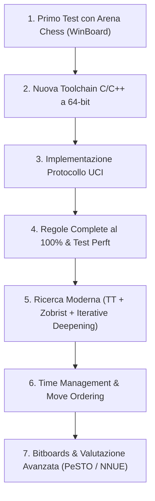

# Stato del Progetto e Piano di Rilancio: LaMoSca

**Data dell'analisi:** Settembre 2026  
**Autore:** Pietro Valocchi (con il supporto dell'assistente AI)  
**Versione di partenza:** LaMoSca v0.10 (Gennaio/Febbraio 2002)

---

## 1. Executive Summary & Contesto Storico

**LaMoSca** (*LAboratorio di MOtori per SCAcchi*) è nato nel 2001-2002 come progetto software divulgativo e didattico in linguaggio **C**, pensato per mostrare l'evoluzione passo-passo della costruzione di un motore scacchistico:
- Dalle versioni primordiali `LaMoSca01` (rappresentazione della scacchiera)
- Alle versioni intermedie `02-05` (generazione mosse pseudolegali, legalità e protocollo per interfacce esterne)
- Fino alla versione `06-10` (valutazione posizionale PST, algoritmi di ricerca dell'albero delle varianti: Minimax, Negamax, Alpha-Beta, ordinamento mosse e ricerca di quiescenza).

Il motore si appoggiava originariamente al protocollo **WinBoard / XBoard (CECP)**, che all'epoca rappresentava lo standard più diffuso.

---

## 2. Diagnosi Tecnica del Software Esistente

### 2.1 Eseguibilità e Compatibilità Attuale
- **Eseguibile binario (`bin/LaMoSca.exe`)**:
  - Compilato nel febbraio 2002 come eseguibile Win32 x86 (PE32).
  - **Funziona nativamente e senza errori** su Windows 10 e Windows 11 a 64-bit grazie al sottosistema di emulazione a 32-bit (WOW64).
  - Risponde regolarmente ai comandi da riga di comando (`help`, `d`, `new`, `e2e4`, `go`, ecc.) ed è in grado di calcolare mosse e stampare la scacchiera ASCII.
- **Codice Sorgente (`src/`)**:
  - Scritto in **C standard (ANSI/C89/C99)** molto chiaro, commentato e leggibile.
  - È privo di dipendenze esterne (solo `<stdio.h>`, `<stdlib.h>`, `<string.h>`, `<signal.h>`).
  - È compilabile immediatamente con qualsiasi toolchain moderna a 64 bit (GCC/MinGW, Clang o MSVC).

### 2.2 Analisi Architetturale del Codice (`v0.10`)

| Modulo | File | Funzionalità Attuale | Limiti Rilevati & Interventi Necessari |
| :--- | :--- | :--- | :--- |
| **I/O & Loop** | `LaMoSca.c` | Gestione comandi console e flag `XBoardMode`. | Supporta solo un sottoinsieme minimale di comandi WinBoard. Manca totalmente il supporto al protocollo standard odierno **UCI**. |
| **Dati & Definizioni** | `Common.h`, `Extern.h` | Rappresentazione mailbox 64 caselle (`Casa B[NUMEROCASE]`). | Struttura a 64 elementi semplice ma costosa per i controlli di scacco. In futuro conviene migrare ai **Bitboards** (`uint64_t`). |
| **Generazione Mosse** | `Genera.c` | Generazione pseudolegale dei pezzi + `Muovi()` / `TornaIndietro()`. | **Regole incomplete**: l'arrocco (`e1g1`, `e1c1`) è intercettato solo come parsing stringa per l'avversario e non è generato dal motore; manca la presa *en passant*; mancano le promozioni a pezzi minori (Sotto-promozioni a Cavallo/Torre/Alfiere); mancano le patte (50 mosse e 3-fold repetition). |
| **Ricerca** | `Cerca.c` | Alpha-Beta a profondità fissa (`sd`, default 4 ply) + Quiescence base + History Heuristic. | Nessun controllo del tempo reale (*time management*). Mancanza della **Transposition Table** con *Zobrist Hashing* (le stesse posizioni vengono ricalcolate ripetutamente). Nessun *Iterative Deepening*. |
| **Valutazione** | `Valuta.c` | Somma materiale + Tabelle Pezzo-Casella (PST) statiche (`SpostaAvanti`, `AlCentro`). | Molto rigida e basica: manca la valutazione della mobilità, della struttura pedonale (pedoni isolati, raddoppiati, passati) e della sicurezza del re. |

---

## 3. Il Mondo dei Motori di Scacchi Oggi (2026)

### 3.1 WinBoard vs UCI
- **WinBoard/XBoard**: Formalmente ancora esistente (progetto GNU), ma è un reperto storico. Nessun motore moderno viene sviluppato oggi pensando a WinBoard come target primario.
- **UCI (Universal Chess Interface)**: È lo standard universale assoluto. Permette al motore di comunicare con qualsiasi GUI (Arena, Cutechess, En-Croissant, Fritz, ChessBase), con framework di test automatici e con le API di bot online (come Lichess).
- **Strategia consigliata per LaMoSca**:
  1. Per vedere LaMoSca subito vivo senza toccare una riga di codice: caricarlo su **Arena Chess** selezionando il protocollo **WinBoard**.
  2. Come prima modifica di codice: **implementare il protocollo UCI**.

### 3.2 Linguaggi di Programmazione: Si usa ancora il C?

Nel mondo del chess programming:
1. **C (C99 / C11)**:
   - *Pro*: Massima semplicità, zero "magia", codice compatto, portabilità assoluta. I capostipiti (TSCP, Crafty, Phalanx) erano in C.
   - *Contro*: Manca di un sistema di tipi forte e di astrazioni moderne ad alte prestazioni (templates, `constexpr`, classi/namespace).
2. **C++ (C++17 / C++20 / C++23)** — **Lo Standard Dominante**:
   - È il linguaggio del 90% dei motori moderni d'élite (Stockfish, Komodo, Berserk, Koivisto, Caissa, Ethereal).
   - *Perché è il più usato:* Offre astrazioni a "costo zero" (*zero-cost abstractions*), calcoli a tempo di compilazione (`constexpr` per generare tabelle di attacco), funzioni intrinsiche standardizzate per bit manipulation (`std::popcount`, `std::countr_zero`), e supporto eccellente per istruzioni vettoriali SIMD (AVX2/AVX-512/NEON) essenziali per le reti **NNUE**.
3. **Rust**:
   - Molto popolare nei progetti nati negli ultimi anni (es. *Rustic*, *Cozy-chess*, *Carp*).
   - Offre sicurezza di memoria, packaging eccellente (`cargo`) e ottime prestazioni, con una curva di apprendimento però più ripida se il codice di partenza è in C.

> **Raccomandazione per LaMoSca:**  
> Il percorso più naturale ed elegante è **rimanere in C** per le prime fasi (o rinominare i file in `.cpp` compilando con un compilatore C++ moderno), beneficiando fin da subito di controlli di tipo più rigorosi, per poi introdurre gradualmente le comodità del C++ (namespace, struct incapsulate, `constexpr`) senza dover riscrivere tutto da zero.

---

## 4. Roadmap di Sviluppo Passo-Passo

### Milestone 1: Verifica immediata con Arena Chess
- Scaricare ed estrarre **Arena Chess** (es. versione 3.5.1).
- Installare `bin/LaMoSca.exe` selezionando il protocollo **WinBoard 1 / 2**.
- Verificare che il motore giochi regolarmente una partita interattiva su scacchiera grafica.

### Milestone 2: Modernizzazione dell'ambiente di compilazione
- Configurare un `Makefile` o `CMakeLists.txt` per compilare il progetto a 64-bit con GCC (MinGW-w64), Clang o MSVC.
- Risolvere i warning del compilatore per garantire conformità agli standard attuali.

### Milestone 3: Implementazione del Protocollo UCI
- Rimpiazzare/affiancare la lettura da console con il set di comandi standard UCI:
  - `uci` -> identifica il motore (`id name LaMoSca`, `id author Pietro Valocchi`) e risponde `uciok`.
  - `isready` -> risponde `readyok`.
  - `position [startpos | fen <fen>] [moves <move1> ... <moveN>]` -> imposta lo stato della scacchiera.
  - `go [depth <x>] [wtime <ms> btime <ms> winc <ms> binc <ms>]` -> avvia il calcolo asincrono o sincrono.
  - `bestmove <mossa>` -> restituisce la mossa scelta (es. `bestmove e2e4`).
  - `quit` -> termina l'applicazione pulitamente.

### Milestone 4: Regole Complete e Validazione tramite Perft
- Aggiungere il parsing e l'export del formato **FEN**.
- Implementare l'arrocco legale completo (aggiornando i diritti di arrocco `KQkq` ad ogni mossa di Re o Torre).
- Implementare la cattura **en passant** (salvando la casella bersaglio nello stato).
- Implementare le promozioni a tutti i pezzi (Donna, Torre, Alfiere, Cavallo sia per l'avversario che durante la ricerca).
- **Implementare Perft (Performance Test)**: funzione ricorsiva di conteggio dei nodi legali su posizioni note. Se i numeri di nodi coincidono con le tabelle ufficiali del Chess Programming Wiki, il motore è certificato al 100% privo di bug regolamentari.

### Milestone 5: Ricerca Moderna (Search)
- **Zobrist Hashing**: generare chiavi hash a 64-bit per ciascuna posizione.
- **Transposition Table (TT)**: memorizzare valutazioni, profondità e mossa migliore trovata (abbatte il tempo di calcolo e permette di trovare mosse buone molto prima).
- **Iterative Deepening**: ricerca a profondità 1, poi 2, poi 3, ecc., riutilizzando la mossa migliore trovata all'iterazione precedente come prima mossa da esplorare.
- **Move Ordering**:
  1. *TT Move* (la mossa della Transposition Table)
  2. *MVV-LVA* (Most Valuable Victim - Least Valuable Attacker) per le catture
  3. *Killer Moves* (mosse tranquille che hanno generato un cut-off beta)
  4. *History Heuristic*

### Milestone 6: Gestione del Tempo e Potature Avanzate
- **Time Manager**: calcolare quanto tempo allocare alla mossa in base all'orologio residuo (`wtime`/`btime`) e all'incremento (`winc`/`binc`).
- **Null-Move Pruning (NMP)**: potare rami dove anche "passando il turno" il giocatore è in vantaggio schiacciante.
- **Late Move Reductions (LMR)**: ridurre la profondità di ricerca per le mosse silenziose posizionate in fondo all'ordinamento delle mosse.

### Milestone 7: Rappresentazione Bitboard e Valutazione NNUE
- Migrare da `Casa B[64]` a 12 **Bitboards** (`uint64_t`), aumentando drasticamente la velocità di generazione mosse.
- **Valutazione**:
  - *Opzione A (Classica)*: Tabelle PeSTO (Piece-Square Tables differenziate per apertura e finale con interpolazione del punteggio).
  - *Opzione B (Moderna / Rivoluzionaria)*: Aggiunta di un'architettura **NNUE** semplice (es. HalfKP 768 -> 256 -> 1 con quantizzazione a interi). Questo singolo passaggio può elevare la forza del motore oltre i **2600-2800 Elo**.

---

## 5. Riferimenti Tecnici Essenziali

- **[Chess Programming Wiki](https://www.chessprogramming.org/)**:
  - [UCI Specification](https://www.chessprogramming.org/UCI)
  - [Perft Results](https://www.chessprogramming.org/Perft_Results)
  - [Zobrist Hashing](https://www.chessprogramming.org/Zobrist_Hashing)
  - [Transposition Table](https://www.chessprogramming.org/Transposition_Table)
  - [NNUE](https://www.chessprogramming.org/NNUE)
- **Tool di Testing e GUI:**
  - [Arena Chess GUI](http://www.playwitharena.com/)
  - [Cutechess & Cutechess-cli](https://cutechess.com/)
  - [En-Croissant GUI](https://encroissant.org/)
- **Motori open source di riferimento per studio:**
  - *TSCP* (l'ispiratore originale di LaMoSca)
  - *Vice* (eccellente motore didattico C di Bluefever Software)
  - *Rustic* (motore moderno didattico ben documentato)
  - *Stockfish* (il riferimento assoluto mondiale per UCI, bitboard e NNUE)
